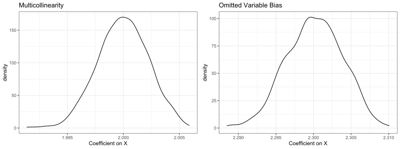

---
categories:
- causal-inference
- exposition
date: '2021-12-20'
title: Multicollinearity or Omitted Variable Bias? Answers to a Seeming Conundrum
toc: true

---

In statistics or causal inference courses, students are usually taught a number of "threats" they need to watch out for when running regression analyses, such as multicollinearity, omitted variable bias, reverse causality, measurement error, selection bias, etc. They often form the impression that the presence of these threats will "bias" their results (more specifically, regression estimations). In this blog post, I discuss a seeming conundrum involving multicollinearity and omitted variable bias.

## What's the Problem?

Suppose you want to explore the effect of $X$ on $Y$ by considering the following simple linear regression model (technically speaking, the population regression equation):

$$
Y=\beta_0+ \beta_1 X + \varepsilon
$$

For expositional simplicity, here I only consider a single independent variable. Adding additional control variables does not fundamentally change the discussion. Now, suppose another variable, $Z$, also has an effect on $Y$. More importantly, $Z$ is correlated with $X$, and let's assume that the degree of correlation is not trivially small to be ignored. The question is: **should you include $Z$ in the regression model or not?** This seemingly innocent question leads to the following conundrum:

- If you include $Z$ in the regression, you have a multicollinearity problem, because $Corr(X,Z)>0$ and the correlation is non-trivial (by assumption);
- If you don't include $Z$ in the regression, you have an omitted variable bias problem, because $Z$, by definition a part of the error term, is correlated with $X$. I.e., $Corr(\varepsilon,X)\neq 0$.

## Nature of the Problem

At first sight, this seems like a real conundrum, and one is forced to choose between two evils. To resolve it, it is important to first realize that **multicollinearity and omitted variable bias are two issues with very different nature**. Thinking they would both "bias" the estimation results is in fact a misconception.

The nature of the omitted variable problem is that it indeed biases coefficient estimations. In this case, roughly speaking:

$$
\mathbb{E}(\widehat{\beta_1}) = \frac{Cov(X,Y)}{Var(X)} = \beta_1 + \frac{Cov(X,\varepsilon)}{Var(X)} \neq \beta_1
$$

In other words, estimation of the parameter of interest, $\beta_1$, does not equal to its true value in expectation. Put differently, even if you have the luxury of having multiple independent samples (on which you can obtain multiple estimations of $\beta_1$), your averaged estimation of $\beta_1$ would still be wrong. 

In comparison, multicollinearity actually does *not* bias your estimates, it inflates the standard error estimation. It means that your estimation of $\beta_1$, while being correct in expectation, is less precise given a fixed sample. Proving the unbiasedness of estimation under multicollinearity takes more work (specifically, relies on the [Frisch–Waugh–Lovell theorem](https://en.wikipedia.org/wiki/Frisch–Waugh–Lovell_theorem) theorem that students typically only encounter in Ph.D. level econometrics course). Therefore, I will use numeric simulations to demonstrate this.

Specifically, I will simulate 5000 data points for the following regression specification:

$$
Y=1+2 \times X + 0.5 \times Z + \varepsilon
$$

where $X \sim N(0,1)$ is the key independent variable of interest; $\varepsilon \sim N(0,0.1^2)$ is the (exogenous) model error term; and $Z=0.6 \times X+N(0,0.5^2)$ is the "confounder" variable. Simple calculation will show that $Corr(X,Z) \approx 0.77$, so if $Z$ is included in the regression with $X$, there is nontrivial multicollinearity. Meanwhile, because $Z$ is indeed in the data generation process of $Y$, not having it in the regression would lead to non-trivial omitted variable bias. The simulation will be repeated for 1000 times (as if I could draw 1000 independent samples, each having 5000 data points, from certain population). The replicable code is included as follows.

```R
set.seed(123456)
N = 5000
N_iter = 1000
# Iterate through 1000 simulation runs
# Store the coefficient estimate on X in a data frame
results = data.frame(beta_mc = rep(NA, N_iter), beta_ovb = rep(NA, N_iter))
for (i in 1:N_iter) {
    # Simulate independent variable X
    X = rnorm(N)
    # Simulate model error term eps
    eps = rnorm(N, sd = 0.1)
    # Simulate Z. Corr(Z,X) is around 0.77
    Z = 0.6*X + rnorm(N, sd = 0.5)
    # Simulate dependent variable Y
    Y = 1 + 2*X + 0.5*Z + eps

    # Have Z in the regression (multicollinearity)
    model_mc = lm(Y ~ X + Z)
    # Do not have Z in the regression (omitted variable bias)
    model_ovb = lm(Y ~ X)

    # store the coefficient on X from the two models
    results[i, 1] = coef(model_mc)["X"]
    results[i, 2] = coef(model_ovb)["X"]
}
```

Next, the empirical distribution of coefficient estimates on $X$ is plotted. 

```R
library(ggplot2)
ggplot(results, aes(x = beta_mc)) +
  geom_density() + 
  labs(x = "Coefficient on X", title = "Multicollinearity") +
  theme_bw()

ggplot(results, aes(x = beta_ovb)) +
  geom_density() +
  labs(x = "Coefficient on X", title = "Omitted Variable Bias") +
  theme_bw()
```



We can see that: (1) when $Z$ is included in the regression, coefficient of $X$ remains unbiased (centered around 2) despite the multicollinearity issue; (2) when $Z$ is excluded from the regression, coefficient of $X$ is biased (centered around 2.3). 

## So What's the Answer?

The simulation seems to suggest that we should *always* include $Z$ in the regression, because doing so does not really lead to any bias but not doing so will bias the estimations. The conclusion, in my opinion, is more nuanced than that.

In a sense, I argue that this conundrum isn't actually a true conundrum (hence the "seeming" conundrum in the article title), and its resolution lies in thinking about **"is $Z$ really a variable that affects $Y$ in addition to $X$"?**

- If $Z$ really is a determinant of $Y$ in addition to $X$, just like what we have simulated (i.e., $Z$ is a part of the data generation process of $Y$), then omitting $Z$ causes bias, and it's probably worth including $Z$ in the regression. This is especially true if one has a sufficiently large sample, which makes the variance-inflation effect of multicollinearity relatively tolerable (from a hypothesis testing point of view);
- However, if $Z$ does not provide any meaningful information beyond $X$, then it shouldn't be in the regression. As an example, think about the case of perfect multicollinearity (i.e., $Z$ is simply a linear function of $X$ such as $Z = 0.6 \times X$), then $Z$ does not provide any extra information beyond $X$ and should be excluded from the regression. Importantly, excluding $Z$ does NOT cause any omitted variable issue because **$Z$ is not part of the regression to begin with**.
- In practice, since the data generation process of $Y$ is almost always unknown (that's why we are running regressions in the first place), it can be hard to decide precisely whether $Z$ provides any information beyond $X$. At the end of the day, the inclusion or exclusion of variables in regression models should be guided by theory (i.e., think about what $X$ and $Z$ each measures in the particular problem context that's being analyzed), not purely by empirics / data.

## Concluding Remarks

In this post, we start from a conundrum that seems difficult at first, but after understanding the nature of the problem, becomes less of a conundrum. At the end of the day, its resolution depends on a subjective judgement (i.e., whether the potential confounder $Z$ should be considered a determinant of $Y$ or not). This is not uncommon in causal inference and is worth highlighting in my opinion. Although causal inference (and econometrics, for that matter) is often taken to be a highly quantitative field with little room for subjectivity, many practical decisions that one has to make when carrying out actual analyses (e.g., model specification, variable inclusion / exclusion) need to rely on subjective judgement and theoretical argumentation. 
