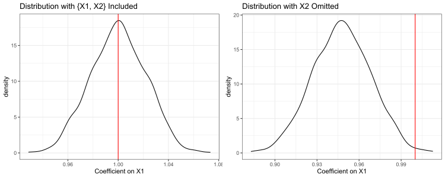

---
categories:
- causal-inference
- exposition
date: '2022-05-24'
description: Logit regression is really weird and I had no idea
title: The Non-Collapsibility of Logistic Regressions
toc: true

---

> Acknowledgement: most of the content in this post come from discussions with [Gord Burtch](https://gburtch.github.io/).

Once in a while, I learn about a fact so mind-blowing that it fundamentally changes how I view certain things. Such moments give me a mixed feeling of anxiety and joy: anxious about all the mistakes I may have made because of my ignorance but happy about the fact that I get to fix that ignorance to some degree. This is one of those moments. It has to do with how one should interpret (and more broadly, think about) coefficient estimates in a logistic regression.

# Collapsibility of Linear Regressions

Before we get to logit regression, let's first take a detour to the nice-and-sunny land of linear regressions. Consider the following data generation process:
$$
Y=1+X_1+0.5X_2, \text{where } X_1 \sim N(1,2^2) \text{ and } X_2 \sim Unif(-2,2) \text{ and } X_1 \bot X_2
$$
In other words, a dependent variable $Y$ is jointly determined by a normal variable $X_1$ and a uniform variable $X_2$, and the two covariates are independent of each other. Simple enough. Now, suppose we want to use linear regression to estimate this relationship, based on a sample of $N=10000$ data points.

In almost all practical statistical inference tasks, we cannot claim to know everything about the data generation process, and there may always be factors that we are not considering in a given regression. For concreteness, let's say that $X_2$ is not included in the regression. Using linear regression terminology, we can say that $X_2$ is (a part of) the model's error term. Because $X_1$ and $X_2$ are independent of each other, omitting $X_2$ does not pose any serious problem to the estimation, except for making the standard errors of coefficients a bit larger. Our estimation of the coefficient on $X_1$ (the included variable) will still be unbiased.

This is also easy to see with a simple simulation:

```R
# simulate data
set.seed(123456)
N = 10000
x1 = rnorm(N, mean = 1, sd = 2)
x2 = runif(N, min = -2, max = 2)
xb = 1 + x1 + 0.5*x2
y_linear = xb

# linear regression, omitting x2
summary(lm(y_linear ~ x1))
# we get a coefficient on x1 of 1.001 and standard error of 0.003
# you can also repeat this multiple times to get the distribution of coefficient and see that it's unbiased.
```

This property, formally known as the **collapsibility** and informally means "independent unobservables are not a problem", feels so natural that I have never truly questioned it. In fact, I cannot imagine living without it. As one can never hope to account for all factors driving a dependent variable, the collapsibility property is necessary to convince ourselves that our estimates are still somewhat useful, by arguing that whatever we leave out of the regression is independent from the things included in the regression. It also enables us to interpret a given coefficient with confidence, saying something like "holding everything else constant, 1 unit change in $X_1$ is associated with 1 unit change in $Y$".

# Non-Collapsibility of Logit Regressions 

Now, the nightmare is that logistic regressions, a tool so commonly used to model binary outcomes, are non-collapsible. Let's continue with the same simulation setup to see this:

```R
# run the previous block to obtain variables
y_logit = rbinom(N, 1, prob = 1/(1+exp(-xb)))

# logit regression, having both x1 and x2
summary(glm(y_logit ~ x1 + x2, family = "binomial"))
# As expected, coefficient estimates are quite close to their true values. After all, we are running the regression with the true data-generation process

# logit regression, omitting x2
summary(glm(y_logit ~ x1, family = "binomial"))
# coefficient on x1 is 0.933 with standard error of 0.022. The true value (1.0) is more than 3 SDs away...

# Perhaps we got unlucky once? Replicating 1000 times to get distribution
set.seed(123456)
est = data.frame(b1_full = rep(NA, N), b1_omit = rep(NA, N))
for (i in 1:1000) {
  x1 = rnorm(N, mean = 1, sd = 2)
  x2 = runif(N, min = -2, max = 2)
  xb = 1 + x1 + 0.5*x2
  y_logit = rbinom(N, 1, prob = 1/(1+exp(-xb)))
  model_full = glm(y_logit ~ x1 + x2, family = "binomial")
  model_omit = glm(y_logit ~ x1, family = "binomial")
  est[i,1] = coef(model_full)[2]
  est[i,2] = coef(model_omit)[2]
}

# Let's plot it
library(ggplot2)
library(gridExtra)
p1 = ggplot(est, aes(x = b1_full)) + 
  geom_density() + 
  geom_vline(xintercept = 1.0, color = "red") + 
  labs(x = "Coefficient on X1", title = "Distribution with {X1, X2} Included") + 
  theme_bw()

p2 = ggplot(est, aes(x = b1_omit)) + 
  geom_density() + 
  geom_vline(xintercept = 1.0, color = "red") + 
  labs(x = "Coefficient on X1", title = "Distribution with X2 Omitted") + 
  theme_bw()

grid.arrange(p1, p2, nrow = 1)
```



The red vertical line marks where the true coefficient value is. We can see that omitting $X_2$ result in biased estimate of the coefficient on $X_1$, despite the fact that $X_2$ is independent from $X_1$!!! As surprising as this is to me, it is actually widely known in fields such as epidemiology (e.g., see [this paper](https://academic.oup.com/aje/article/190/5/697/6030882) and [this blog post](http://jakewestfall.org/blog/index.php/2018/03/12/logistic-regression-is-not-fucked/)). 

So what should we do if we still want to use logistic regression for statistical inference? Short answer is that any coefficient can only be interpreted as a "conditional effect", condition on the other covariates that you choose to include in the regression. Change the covariates included, you may also change the coefficient estimate of any focal covariate, even if they are all independent. [This blog post](http://jakewestfall.org/blog/index.php/2018/03/12/logistic-regression-is-not-fucked/) has some additional recommendations.
