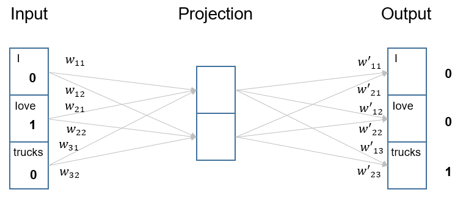

---
categories:
- machine-learning
- exposition
date: '2022-07-12'
description: A step-by-step illustration of skip-gram and continuous bag-of-words
  models
title: Training Word Embeddings
toc: true

---

This post walks through a small concrete example to illustrate the skip-gram (SG) architecture to train word embeddings. The continuous bag-of-words (CBOW) architecture can be understood by following a very similar procedure.

## Setup

To make the mathematical details easier to follow, we will stick with a very small example. Specifically, imagine the training corpus contains a single sentence "I love trucks", and our goal is to learn 2-dimensional embedding (i.e., $D=2$) for each of the three words in vocabulary $V=(I,love,trucks)$. In practice, the training corpus typically contains a very large amounts of texts (e.g., millions of sentences), the vocabulary size is usually tens of thousands, and the embedding dimension is usually a few hundreds.

## Skip-Gram Architecture

The skip-gram model trains word embeddings by using a given focal word to predict a context word (i.e., a word in the vicinity of the focal word). The architecture is a fully-connected, feed-forward neural network with three layers: an input layer, a "projection" layer, and an output layer. The "projection" layer is a bit different from a typical hidden layer, in the sense that it does not apply any non-linear activation. For concreteness, consider the following training example from our sentence: let's pick "love" as the focal word and use it to predict "trucks". In other word, "love" is the input and the desired output is "trucks".[^1] 

In the skip-gram network, both the input and output layers have exactly $V$ neurons. The input layer is simply one-hot encoding of the input, i.e., the input neurons take values 1/0, corresponding to each words in the vocabulary. The output layer has the standard softmax activation. Importantly, the projection layer contains exactly $D$ neurons. Its purpose is to "project" each input word to the embedding space (with dimension $D$), and then to "project" the embedding representation to produce the output. Using the $love \rightarrow trucks$ training example, here is exactly what happens in the network:

where $w_{ij}$ denote the weights from input to projection, and $u_{ji}$ denote the weights from projection to output. For conciseness, we can also write these weights as vectors: $\vec{w_1} = (w_{11},w_{12})$, $\vec{w_2} = (w_{21},w_{22})$, $\vec{w_3} = (w_{31},w_{32})$; and similarly $\vec{u_1}=(u_{11},u_{21})$, $\vec{u_2}=(u_{12},u_{22})$, $\vec{u_3}=(u_{13},u_{23})$.

Now, let's run through the network and compute the information that flows in and out of each layer:

| Layer                   | Information In                                               | Information Out                                              |
| ----------------------- | ------------------------------------------------------------ | ------------------------------------------------------------ |
| Input                   | word "love"                                                  | One-hot encoding $(0,1,0)$                                   |
| Projection (1st neuron) | $0 \cdot w_{11}+1\cdot w_{21}+0\cdot w_{31} = w_{21}$        | $w_{21}$ (directly pass the information)                     |
| Projection (2nd neuron) | $0 \cdot w_{12}+1\cdot w_{22}+0\cdot w_{32} = w_{22}$        | $w_{22}$ (directly pass the information)                     |
| Output (1st neuron)     | $w_{21} \cdot u_{11} + w_{22} \cdot u_{21} = \vec{w_2} \boldsymbol{\cdot} \vec{u}_1$ | $\frac{\exp(\vec{w_2} \boldsymbol{\cdot} \vec{u_1})}{\sum_{i=1}^3 \exp(\vec{w_2} \boldsymbol{\cdot} \vec{u_i})}$ (standard softmax activation) |
| Output (2nd neuron)     | $w_{21} \cdot u_{12} + w_{22} \cdot u_{22} = \vec{w_2} \boldsymbol{\cdot} \vec{u}_2$ | $\frac{\exp(\vec{w_2} \boldsymbol{\cdot} \vec{u_2})}{\sum_{i=1}^3 \exp(\vec{w_2} \boldsymbol{\cdot} \vec{u_i})}$ (standard softmax activation) |
| Output (3rd neuron)     | $w_{21} \cdot u_{13} + w_{22} \cdot u_{23} = \vec{w_2} \boldsymbol{\cdot} \vec{u}_3$ | $\frac{\exp(\vec{w_2} \boldsymbol{\cdot} \vec{u_3})}{\sum_{i=1}^3 \exp(\vec{w_2} \boldsymbol{\cdot} \vec{u_i})}$ (standard softmax activation) |

Then, comparing the softmax-transformed probabilities at the output layer with the label $(0,0,1)$, one can derive the loss value associated with this example.[^2] Via gradient descent, the goal is to learn the network weights.

Importantly, **the network weights are treated as the embeddings of words**. For example, $(w_{11},w_{12})$ is the 2-dimensional embedding of the word "I", because it projects the word "I" into a 2-dimensional space. Notice that, in the above example, each word has two embeddings, respectively from the weights connecting input to projection and from the weights connecting projection to output (e.g., $\vec{w_1}$ and $\vec{u_1}$ for word "I"). The skip-gram model uses the weights connecting input to project (i.e., $\vec{w_i}$) as the word embedding, whereas $\vec{u_i}$ are sometimes referred to as "context word embeddings". It is important to treat the two sets of embeddings as separate embeddings (rather than share those parameters). Otherwise, the dot product between the input / focal word and itself (in the above example, $\vec{w_2} \boldsymbol{\cdot} \vec{u}_2$) will tend to have a much higher value than other dot products, even though the same word does not usually appear in the context of the focal word (for more technical details, see [this pre-print](https://arxiv.org/pdf/1402.3722.pdf)).

## Continuous Bag-of-Words (CBOW)

The CBOW architecture can be understood in a similar way, by walking through the above example (a good exercise for readers). The key different is that CBOW uses a collection of context words to predict a focal word (analogous to a "fill in the blank" language task).

[^1]: In other words, each training instance is a pair of focal and context words. Additional technical details such as *negative sampling* is ignored here for simplicity. 
[^2]: Of course, when training with many examples in practice, the loss values associated with all training instances in a batch will be summed before the gradient is computed.
