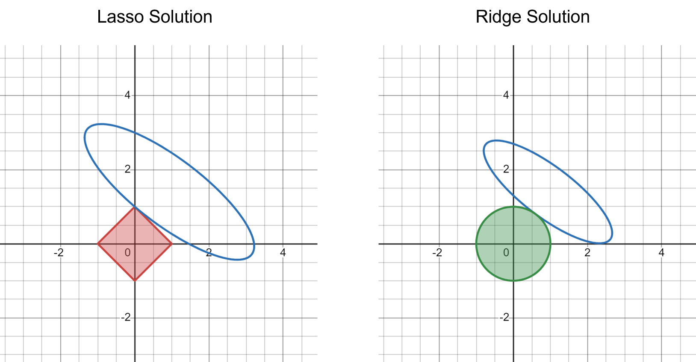

Lasso and Ridge regressions are two popular machine learning methods for both classification and numeric prediction tasks. They apply a shrinkage term on top of a standard multivariate linear regression that penalizes model complexity. Specifically, the shrinkage term for Lasso is the $L_1$ norm of all parameters / coefficients, whereas it is the $L_2$ norm for Ridge. 

Interestingly, if you have used Lasso and Ridge in practice, you will likely notice that Lasso is much more likely to penalize some coefficients to _exactly 0_ than Ridge. As such, Lasso is sometimes used as a feature selection mechanism. This blog post provides an intutive and graphical explanation about why this is the case. This post is inspired by the textbook [The Elements of Statistical Learning](https://hastie.su.domains/Papers/ESLII.pdf) by Hastie, Tibshirani, and Friedman.

## An Optimization Formulation of Lasso and Ridge

For concreteness and ease of visualization, let's think about training a Lasso / Ridge regression model using two features $\{X_1, X_2\}$ to predict a real-valued output $Y$. Suppose we have a set of training data $\{X_{1,i}, X_{2,i}, Y_i\}_{i=1}^N$. The learning problem of Lasso / Ridge can be formulated as a minimization problem with a regularization term:

$$
\min_{\beta_1, \beta_2} \sum_{i=1}^N \left(Y_i - X_{1,i} \beta_1 - X_{2,i} \beta_2 \right)^2 + \lambda \cdot \text{regularization}
$$

where $\text{regularization} = |\beta_1| + |\beta_2|$ for Lasso and $\text{regularization} = \beta_1^2 + \beta_2^2$ for Ridge. 

While this is technically correct, it is not easy to see why Lasso regularization is more likely to reduce some coefficients exactly to 0. Instead, we will rephrase the learning problem as a contrained optimization problem:

$$
\text{     Lasso:     }\min_{\beta_1, \beta_2} \sum_{i=1}^N \left(Y_i - X_{1,i} \beta_1 - X_{2,i} \beta_2 \right)^2 \text{     subject to     } |\beta_1| + |\beta_2| \leq t
$$

and

$$
\text{     Ridge:     }\min_{\beta_1, \beta_2} \sum_{i=1}^N \left(Y_i - X_{1,i} \beta_1 - X_{2,i} \beta_2 \right)^2 \text{     subject to     } \beta_1^2 + \beta_2^2 \leq t
$$

Just like the $\lambda$ parameter, the $t$ parameter controls the magnitude of the complexity penalty. The benefits of this contrained optimization formulation is that it is much easier to visualize.

## Graphical Explanation

The first step to understand what the regularization term does is to visualize three terms: the residual sum of square (as the loss function) and the two constraints. 

First, $\sum_{i=1}^N \left(Y_i - X_{1,i} \beta_1 - X_{2,i} \beta_2 \right)^2$ might look intimidating, but viewed as a function of coefficients $\beta_1$ and $\beta_2$, it is nothing but a quadratic function

$$
\begin{align*}
\sum_{i=1}^N \left(Y_i - X_{1,i} \beta_1 - X_{2,i} \beta_2 \right)^2 =& \sum_{i=1}^N X_{1,i}^2 \beta_1^2 + \sum_{i=1}^N X_{2,i}^2 \beta_2^2 \\
&+ 2\sum_{i=1}^N X_{1,i}X_{2,i} \beta_1 \beta_2 - 2\sum_{i=1}^N X_{1,i}Y_i \beta_1 - 2\sum_{i=1}^N X_{2,i}Y_i \beta_2 \\
&+ \sum_{i=1}^N Y_i^2
\end{align*}
$$

This is nothing but an [ellipse in 2-D](https://en.wikipedia.org/wiki/Ellipse#General_ellipse)!

Next, $|\beta_1| + |\beta_2| \leq t$ is a square with side length $\sqrt{2}t$ centered around origin and $\beta_1^2 + \beta_2^2 \leq t$ is a circle with radius $\sqrt{t}$ centered around origin.

Moreover, to represent the contrained optimization problem, simply let $L(\beta_1, \beta_2) = \sum_{i=1}^N \left(Y_i - X_{1,i} \beta_1 - X_{2,i} \beta_2 \right)^2$ be the value of the residual sum of square given a specific set of values for $\beta_1, \beta_2$, then the contrained optimization problem is equivalent to **finding the smallest $L(\beta_1, \beta_2)$ value such that the ellipse intersect with the square (for Lasso) or the circle (for Ridge)**.

The following figure visualizes the idea:

Because the Lasso shrinkage term takes a square shape with sharp end points and flat edges, it is much more likely for the ellipse to intersect at the end points (causing at least one of the parameters to be exactly 0). In contrast, the Ridge shrinkage term is a round circle, and the ellipse may intersect at any point on the circle. This general intuitive becomes much stronger in higher dimensions, when the 2-D square becomes a high-dimensional cube and 2-D circle becomes a high-dimensional sphere.
